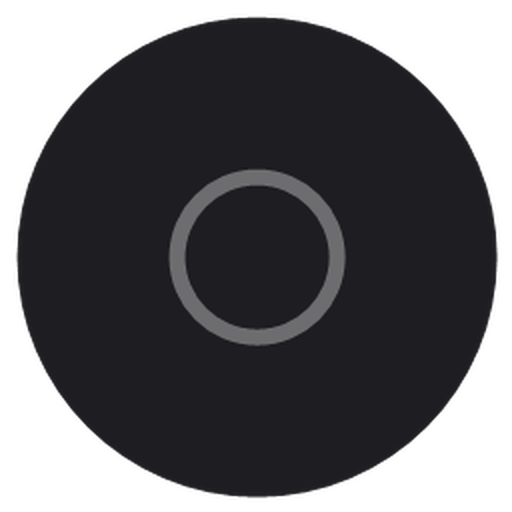

<div align="center">



# CIRCA

**CIR**cular **CA**mera —— 常驻置顶的圆形摄像头悬浮窗。

把你的画面叠在幻灯片、录屏和播客画面之上，就像 Loom 和 mmhmm 那样，而不必拖上一个完整的视频套件。

[](https://github.com/anjingcuc/circa/actions/workflows/ci.yml)
[](https://github.com/anjingcuc/circa/actions/workflows/release.yml)
[](https://github.com/anjingcuc/circa/releases/latest)
[](LICENSE)
[](https://github.com/anjingcuc/circa/releases/latest)

**简体中文** | [English](README.en.md)

基于 Rust + [Tauri 2](https://v2.tauri.app/) 移植自 [raffimd2/camera-floating-panel](https://github.com/raffimd2/camera-floating-panel)（Electron）

</div>

---

## 功能特性

- **圆形摄像头悬浮窗** —— 无边框、透明、始终置顶，可悬浮在全屏 PowerPoint 放映之上
- **拖拽移动、滚轮缩放**（120–800 px，始终保持正圆）
- **摄像头切换** —— 支持热插拔，插入新设备即时刷新列表，选择自动记忆
- **点击穿透** —— 开启后鼠标点击直达下方的幻灯片，悬浮窗只负责"露脸"
- **体积轻巧** —— 原生 Rust 核心 + 系统 WebView2，安装包仅约 2 MB

> [!NOTE]
> CIRCA 只负责画面渲染，不处理音频。请使用录屏软件的**全屏录制模式**，让它同时捕获幻灯片与悬浮窗；麦克风音频由录屏软件自行处理。

## 下载安装

从 **[Releases](https://github.com/anjingcuc/circa/releases/latest)** 页面获取最新版：

| 文件 | 说明 |
|---|---|
| `CIRCA_x.y.z_x64-setup.exe` | NSIS 安装包（推荐） |
| `CIRCA_x.y.z_x64_portable.exe` | 便携版 —— 单个 exe，下载即用，免安装、不写注册表 |
| `checksums.txt` | 各文件的 SHA256 校验和 |

> [!IMPORTANT]
> 支持 Windows 10/11（x64）。首次启动会弹出 Windows 相机权限提示，请允许一次，摄像头名称才能正常显示。

> [!NOTE]
> 便携版依赖系统已有的 WebView2 运行时（Windows 11 自带，多数 Windows 10 已预装）；若便携版无法启动，请改用安装包，它会自动安装 WebView2。

## 使用

将鼠标悬停在圆窗上即可唤出控制条。

| 操作 | 方式 |
|---|---|
| 移动 | 在圆窗上任意位置拖拽 |
| 缩放 | 在圆窗上滚动滚轮（120–800 px） |
| 切换摄像头 | 悬停条中的下拉框（设备插拔后自动刷新） |
| 开关点击穿透 | 👆 按钮或全局热键 **Ctrl+Shift+C**（穿透开启时依然有效） |
| 最小化 / 关闭 | 悬停条中的 — / ✕ 按钮 |

> [!TIP]
> 点击穿透开启时，把鼠标移到底部控制条上会自动恢复可点击状态（Rust 侧 30 Hz 光标监视实现），无需热键也能随时关闭穿透。

## 从源码构建

前置要求：[Rust](https://rustup.rs/)（stable）、[Node.js](https://nodejs.org/)（LTS）、带 WebView2 的 Windows。

```bash
git clone https://github.com/anjingcuc/circa.git
cd circa
npm install
npm run dev     # 开发调试
npm run build   # 生成 NSIS 安装包 + 独立 exe（位于 src-tauri/target/release）
```

### 项目结构

```
dist/                    前端 —— 纯 HTML/CSS/JS（摄像头采集与 UI 交互）
src-tauri/src/main.rs    Rust —— 窗口管理、穿透光标监视、全局热键、缩放命令
src-tauri/               Tauri 2 应用配置、权限、图标与打包设置
.github/workflows/       CI 检查 + 标签触发的自动构建发布
```

## 与原版的对比

本项目是 [raffimd2/camera-floating-panel](https://github.com/raffimd2/camera-floating-panel)（Electron）的 Rust/Tauri 移植版：

| | 原版（Electron） | CIRCA（Tauri / Rust） |
|---|---|---|
| 运行时 | 内置 Chromium（Electron 32） | 系统 WebView2 + 原生 Rust 核心 |
| 安装包体积 | ~80 MB+ | ~2 MB |
| 点击穿透 | Electron 鼠标事件转发 | Rust 侧 30 Hz 轮询系统光标（Win32 `GetCursorPos`），控制条始终可达 |
| UI | 原生 HTML/CSS/JS | 与原版一致，直接复用 |
| 平台 | Windows | Windows（NSIS 构建） |

## 致谢

- **[raffimd2/camera-floating-panel](https://github.com/raffimd2/camera-floating-panel)** —— 原始 Electron 项目。CIRCA 是它的 Rust/Tauri 移植版，并复用了其前端 UI 与设计，原始创意与交互设计均归原作者所有。
- 本项目基于 [Tauri 2](https://v2.tauri.app/) 构建，以 MIT 协议开源，许可证中注明了与上游项目的衍生关系。如原作者对署名或授权方式另有期望，欢迎[开 issue](https://github.com/anjingcuc/circa/issues)联系。

<div align="center">
<sub>用 🦀 录制幻灯片时打造。</sub>
</div>
